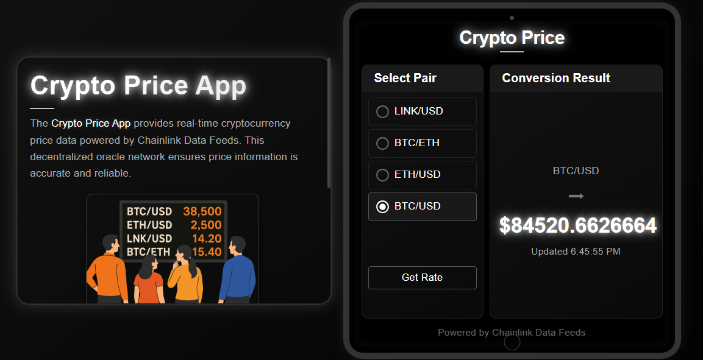
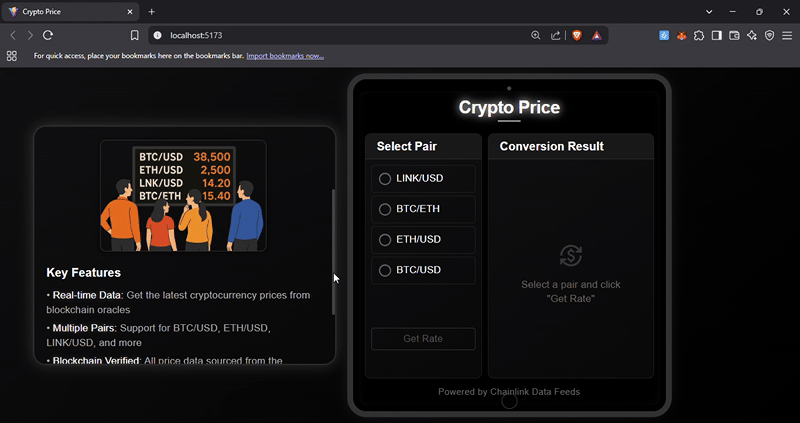

# Crypto Price App

A real-time cryptocurrency price tracking application powered by Chainlink Data Feeds. This decentralized app fetches the latest cryptocurrency prices directly from blockchain oracles, ensuring accurate and reliable data.

## Features

- **Real-time Data**: Get the latest cryptocurrency prices from Chainlink's decentralized oracle network
- **Multiple Trading Pairs**: Support for BTC/USD, ETH/USD, LINK/USD, and BTC/ETH
- **Blockchain Verified**: All price data sourced from the Chainlink network
- **Simple Interface**: Elegant, user-friendly design for easy navigation

## Screenshot



## Demo



## Technology Stack

- **Frontend**: React.js with Material-UI
- **Blockchain**: Ethereum
- **Smart Contract**: Solidity
- **Data Feeds**: Chainlink Oracles

## How It Works

1. Select a cryptocurrency trading pair from the dropdown
2. Click "Get Rate" to fetch the latest price
3. The app connects to an Ethereum smart contract
4. The contract queries Chainlink Data Feeds
5. Real-time price data is displayed on the interface

## Getting Started

### Prerequisites

- Node.js and npm
- MetaMask wallet extension

### Installation

1. Clone the repository
   ```bash
   git clone https://github.com/yourusername/crypto-price-app.git
   cd crypto-price-app